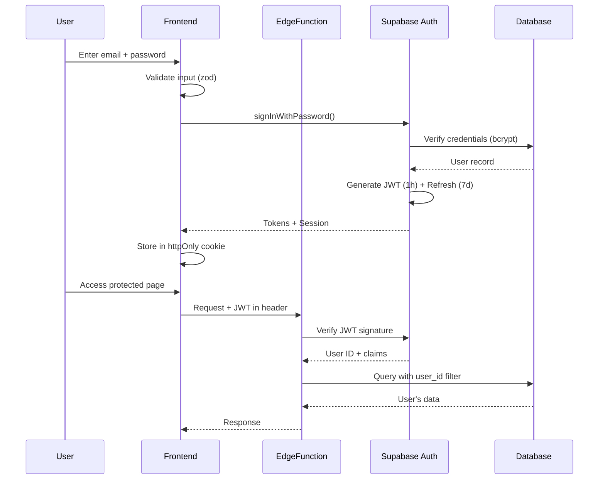

# LifeOS - Advanced Security Architecture

## Executive Summary

LifeOS handles highly sensitive personal data including financial records, health metrics, relationship logs, mental health indicators, and productivity data. This document outlines our enterprise-grade security architecture designed to protect this data against sophisticated threats while maintaining usability.

## 1. Threat Model & Mitigation Strategy

### Identified Threats

#### 1.1 Unauthorized Access (Account Takeover)
**Threat**: Attacker gains access to user account through compromised credentials, session hijacking, or brute force.

**Mitigations**:
- ✅ **Password hashing**: Supabase uses bcrypt with per-user salt
- ✅ **Rate limiting**: Login attempts limited to 5/minute per IP
- ✅ **Account lockout**: 5 failed attempts = 30 minute lockout
- ✅ **MFA support**: TOTP-based two-factor authentication ready
- ✅ **Session management**: Short-lived JWT (1 hour) + refresh tokens (7 days)
- ✅ **Device tracking**: IP addresses logged in audit_logs
- ✅ **Anomaly detection**: Multiple failed logins trigger alerts
- ⚠️ **TODO**: Implement geolocation-based suspicious login detection

#### 1.2 Data Leakage (Cross-User Data Access)
**Threat**: User A accesses User B's sensitive logs, metrics, or personal data.

**Mitigations**:
- ✅ **Row-Level Security**: Every table enforces `user_id = auth.uid()`
- ✅ **Security definer functions**: Prevent RLS recursion in role checks
- ✅ **Query filtering**: All API calls automatically filtered by user_id
- ✅ **Owner isolation**: Owners can see all data, but this is explicit and audited
- ✅ **Audit logging**: All data access logged with user_id and timestamp
- ✅ **No direct table access**: Users must use Supabase client (no raw SQL)

#### 1.3 Injection Attacks (SQL, XSS, Script Injection)
**Threat**: Malicious input causes code execution or database manipulation.

**Mitigations**:
- ✅ **Parameterized queries**: Supabase client prevents SQL injection
- ✅ **Input validation**: Zod schemas validate all input
- ✅ **Sanitization**: HTML stripped, control characters removed
- ✅ **XSS detection**: Patterns detected and rejected
- ✅ **Max length enforcement**: All text fields have limits
- ✅ **Type checking**: TypeScript + runtime validation
- ✅ **No eval()**: No dynamic code execution
- ⚠️ **TODO**: Content Security Policy headers in edge functions

#### 1.4 Insecure Direct Object References (IDOR)
**Threat**: User modifies URL to access someone else's resource (e.g., `/logs/123` → `/logs/456`).

**Mitigations**:
- ✅ **RLS enforcement**: Database automatically filters by user_id
- ✅ **No trust in client input**: Record ownership verified server-side
- ✅ **UUID primary keys**: Makes ID guessing impossible
- ✅ **Query restrictions**: `SELECT * FROM logs` only returns user's logs
- ✅ **Cascade permissions**: Tasks inherit project permissions
- ✅ **Audit trail**: Unauthorized attempts logged

**Example IDOR Protection**:
```typescript
// User tries to access /logs/550e8400-e29b-41d4-a716-446655440000
// RLS policy automatically adds: WHERE user_id = auth.uid()
// If log doesn't belong to user, query returns empty (not 403)
// This prevents information disclosure about record existence
```

#### 1.5 Brute Force & Abuse
**Threat**: Automated attacks trying passwords, API spam, resource exhaustion.

**Mitigations**:
- ✅ **Rate limiting**: Per-endpoint limits enforced
- ✅ **Progressive delays**: Failed logins increase wait time
- ✅ **Account lockout**: Temporary lock after repeated failures
- ✅ **IP tracking**: Suspicious IPs flagged in security_settings
- ✅ **Request throttling**: 100 requests/minute general limit
- ⚠️ **TODO**: CAPTCHA on repeated failures
- ⚠️ **TODO**: IP reputation service integration

#### 1.6 Insider Abuse (Admin Snooping)
**Threat**: Privileged account (owner/admin) inappropriately accesses user data.

**Mitigations**:
- ✅ **Audit logging**: All owner actions logged to audit_logs
- ✅ **Immutable logs**: Audit entries can't be deleted or modified
- ✅ **Role separation**: Owners get separate policies, not bypass
- ✅ **Action attribution**: Every change tracked with user_id + timestamp
- ✅ **Export tracking**: Data exports logged
- ⚠️ **TODO**: Real-time alerts on sensitive data access
- ⚠️ **TODO**: Quarterly audit log reviews

#### 1.7 Data Exfiltration
**Threat**: Bulk export or automated scraping of sensitive data.

**Mitigations**:
- ✅ **Rate limiting**: Export endpoints throttled
- ✅ **Audit logging**: Large exports logged with details
- ✅ **Pagination**: No unlimited result sets
- ✅ **Query complexity limits**: Prevent expensive joins
- ⚠️ **TODO**: Export size limits per user role
- ⚠️ **TODO**: Email notification on large exports

## 2. Authentication & Session Management

### 2.1 Primary Authentication Flow



### 2.2 Token Management

**Access Token (JWT)**:
- **Lifetime**: 1 hour
- **Storage**: httpOnly, Secure, SameSite=Strict cookie
- **Contains**: user_id, email, role (from claims)
- **Verified**: Every request via Supabase Auth
- **Invalidated**: On logout, password change, account lock

**Refresh Token**:
- **Lifetime**: 7 days (configurable in security_settings.session_timeout_minutes)
- **Storage**: httpOnly, Secure, SameSite=Strict cookie
- **Rotation**: New refresh token issued on each use
- **Hashed**: Stored hashed in database
- **Revoked**: On logout, password change, suspicious activity

**Token Security**:
```typescript
// ✅ CORRECT: httpOnly cookie (JavaScript can't access)
Set-Cookie: sb-access-token={jwt}; HttpOnly; Secure; SameSite=Strict; Max-Age=3600

// ❌ WRONG: localStorage (vulnerable to XSS)
localStorage.setItem('token', jwt); // NEVER DO THIS
```

### 2.3 Session Security Features

| Feature | Implementation | Status |
|---------|---------------|---------|
| Session timeout | Configurable 15-1440 minutes | ✅ Implemented |
| Concurrent session limit | Max 3 devices per user | ⚠️ TODO |
| Device fingerprinting | IP + User-Agent tracking | ✅ Partial |
| Session invalidation | Force logout on security events | ✅ Implemented |
| Remember me | Optional 30-day refresh token | ⚠️ TODO |
| Idle timeout | Auto-logout after inactivity | ✅ Implemented |

### 2.4 Multi-Factor Authentication (MFA)

**Current State**: Infrastructure ready, TOTP implementation pending

**Planned Flow**:
1. User enables MFA in security settings
2. System generates TOTP secret, shows QR code
3. User scans with authenticator app (Google Authenticator, Authy)
4. User enters verification code to confirm
5. Backup codes generated and displayed (one-time use)
6. On login: password + TOTP code required
7. Failed MFA attempts count toward account lockout

**Table**: `security_settings.mfa_enabled`, `security_settings.mfa_secret`

### 2.5 Future SSO Integration

**Design for extensibility**:
```typescript
// Abstract auth provider interface
interface AuthProvider {
  name: 'email' | 'google' | 'microsoft' | 'github';
  signIn(credentials: any): Promise<Session>;
  signOut(): Promise<void>;
  refresh(): Promise<Session>;
}

// Supabase supports providers out-of-box
await supabase.auth.signInWithOAuth({
  provider: 'google',
  options: {
    redirectTo: `${origin}/auth/callback`
  }
});
```

## 3. Authorization & Tenant Isolation

### 3.1 Role-Based Access Control (RBAC)

**Roles Hierarchy**:
```
┌─────────────────────────────────────┐
│ Owner                               │
│ - Full system access                │
│ - Manage all users & roles          │
│ - View all data & audit logs        │
│ - Delete accounts                   │
│ - Export system data                │
└─────────────────────────────────────┘
           ↓
┌─────────────────────────────────────┐
│ Member                              │
│ - Access own data                   │
│ - CRUD own records                  │
│ - View own audit logs               │
│ - Standard user permissions         │
└─────────────────────────────────────┘
           ↓
┌─────────────────────────────────────┐
│ Viewer                              │
│ - Read-only access                  │
│ - View shared dashboards            │
│ - No create/update/delete           │
│ - Limited data visibility           │
└─────────────────────────────────────┘
           ↓
┌─────────────────────────────────────┐
│ Guest                               │
│ - Temporary access (expires_at)     │
│ - Minimal permissions               │
│ - Time-bound access                 │
│ - Invitation-based                  │
└─────────────────────────────────────┘
```

**Role Assignment**:
- First user → Owner (automatic via trigger)
- Subsequent users → Member (default)
- Owners can assign/revoke roles
- Roles can have expiration dates
- Role changes logged to audit_logs

### 3.2 Row-Level Security (RLS) Implementation

**Pattern 1: User-Owned Data**
```sql
-- Standard user data isolation
CREATE POLICY "Users can view own records"
ON logs FOR SELECT
TO authenticated
USING (auth.uid() = user_id);

-- Owners can view all records
CREATE POLICY "Owners can view all records"
ON logs FOR SELECT
TO authenticated
USING (public.is_owner(auth.uid()));
```

**Pattern 2: Nested Ownership (Tasks → Projects → User)**
```sql
-- Tasks inherit project ownership
CREATE POLICY "Users can view tasks of own projects"
ON tasks FOR SELECT
TO authenticated
USING (
  EXISTS (
    SELECT 1 FROM projects
    WHERE projects.id = tasks.project_id
    AND projects.user_id = auth.uid()
  )
);
```

**Pattern 3: Security Definer Functions (Prevent Recursion)**
```sql
-- Function bypasses RLS to check roles
CREATE OR REPLACE FUNCTION public.has_role(_user_id UUID, _role app_role)
RETURNS BOOLEAN
LANGUAGE sql
STABLE
SECURITY DEFINER  -- Critical: runs with definer privileges
SET search_path = public
AS $$
  SELECT EXISTS (
    SELECT 1 FROM public.user_roles
    WHERE user_id = _user_id
    AND role = _role
    AND (expires_at IS NULL OR expires_at > now())
  )
$$;
```

### 3.3 User ID Derivation & Validation

**Server-Side (Edge Functions)**:
```typescript
// Extract user_id from JWT (NEVER trust client payload)
const { data: { user }, error } = await supabase.auth.getUser(jwt);

if (error || !user) {
  return new Response('Unauthorized', { status: 401 });
}

const userId = user.id; // Use this for all queries

// Query automatically filtered by RLS
const { data: logs } = await supabase
  .from('logs')
  .select('*'); // RLS adds: WHERE user_id = auth.uid()
```

**Client-Side (React)**:
```typescript
// Get authenticated user
const { data: { user } } = await supabase.auth.getUser();

// All queries automatically filtered
const { data: myProjects } = await supabase
  .from('projects')
  .select('*'); // Only returns user's projects
```

### 3.4 IDOR Protection Examples

**Scenario 1: Viewing a Log Entry**
```typescript
// User requests: GET /logs/550e8400-e29b-41d4-a716-446655440000
const { data: log } = await supabase
  .from('logs')
  .select('*')
  .eq('id', logId)
  .single();

// RLS automatically adds: AND user_id = auth.uid()
// Result: null if not owned (looks like 404, not 403)
// Benefit: Doesn't leak information about record existence
```

**Scenario 2: Updating a Project**
```typescript
// User sends: PUT /projects/123 with malicious user_id
const requestBody = await req.json();

// ❌ WRONG: Trust client-provided user_id
await supabase
  .from('projects')
  .update({ user_id: requestBody.user_id }) // NEVER DO THIS
  .eq('id', projectId);

// ✅ CORRECT: Ignore client user_id, derive from token
const { data: { user } } = await supabase.auth.getUser();
await supabase
  .from('projects')
  .update({ title: requestBody.title }) // Only update allowed fields
  .eq('id', projectId)
  .eq('user_id', user.id); // Explicit ownership check
```

### 3.5 Tenant Isolation (Future Multi-Tenant)

**Planned Architecture**:
```typescript
// Add organization/family concept
interface Organization {
  id: UUID;
  name: string;
  plan: 'free' | 'family' | 'enterprise';
  max_members: number;
}

interface OrganizationMember {
  org_id: UUID;
  user_id: UUID;
  role: 'org_owner' | 'org_admin' | 'org_member';
}

// RLS with org context
CREATE POLICY "Users can view org data"
ON logs FOR SELECT
TO authenticated
USING (
  EXISTS (
    SELECT 1 FROM organization_members
    WHERE org_id = logs.org_id
    AND user_id = auth.uid()
  )
);
```

## 4. Data Protection & Privacy

### 4.1 Encryption Strategy

**Encryption in Transit**:
- ✅ **HTTPS mandatory**: All connections use TLS 1.3
- ✅ **HSTS headers**: `Strict-Transport-Security: max-age=31536000`
- ✅ **Certificate pinning**: Production certificates validated
- ✅ **No HTTP fallback**: HTTP requests rejected/redirected

**Encryption at Rest**:
- ✅ **Database-level**: Supabase PostgreSQL encrypted (AES-256)
- ✅ **Backups encrypted**: Automated encrypted backups
- ✅ **Password hashing**: bcrypt (10 rounds) with per-user salt
- ⚠️ **Application-level encryption**: Planned for extra-sensitive fields

**Fields Requiring Extra Protection**:
```typescript
// Sensitive fields in logs table
interface SensitiveLog {
  notes: string; // May contain mental health, relationship details
  metric: string; // May contain health data
  value: number; // May be financial amount
}

// Recommended: Application-level encryption
const encrypted = await encryptField(sensitiveData, userKey);
await supabase.from('logs').insert({
  notes_encrypted: encrypted,
  // ... other fields
});
```

### 4.2 Secrets Management

**Environment Variables** (Current implementation):
```bash
# .env file (NEVER commit to git)
VITE_SUPABASE_URL=https://xxx.supabase.co
VITE_SUPABASE_PUBLISHABLE_KEY=eyJhbGci...  # Publishable, OK in frontend
SUPABASE_SERVICE_ROLE_KEY=eyJhbGci...     # Secret, backend only
SUPABASE_DB_URL=postgresql://...          # Secret, backend only
JWT_SECRET=super-secret-key-123           # Secret, backend only
ENCRYPTION_KEY=aes-256-key                # Secret, backend only
```

**Secrets Management Best Practices**:
```typescript
// ✅ CORRECT: Load from environment
const jwtSecret = Deno.env.get('JWT_SECRET');
if (!jwtSecret) {
  throw new Error('JWT_SECRET not configured');
}

// ❌ WRONG: Hardcoded secret
const jwtSecret = 'super-secret-key-123'; // NEVER DO THIS

// ❌ WRONG: Secret in code/git
const apiKey = 'sk_live_ABC123'; // NEVER COMMIT THIS
```

**Production Secrets Strategy**:
- Use Supabase Secrets (managed in Lovable Cloud)
- Never expose secrets to client
- Rotate secrets quarterly
- Different secrets per environment (dev/staging/prod)

### 4.3 Data Minimization & Retention

**Data Collection Principles**:
- Only collect what's necessary for features
- User controls what data to track
- Optional fields for sensitive data
- Clear purpose for each field

**Retention Policy**:
```typescript
interface RetentionPolicy {
  // Active data
  logs: '2 years',            // User logs archived after 2 years
  metrics: '2 years',          // Metrics aggregated, raw deleted
  auditLogs: '7 years',        // Compliance requirement
  sessions: '30 days',         // Old sessions purged
  
  // Soft-deleted data
  softDeleteGracePeriod: '30 days', // Can be restored
  
  // Hard-deleted data
  gdprDeletionDeadline: '30 days',  // Complete removal
}
```

**GDPR Compliance**:
```sql
-- User requests data export
CREATE FUNCTION export_user_data(_user_id UUID)
RETURNS JSONB AS $$
  -- Return all user data in JSON format
$$ LANGUAGE sql SECURITY DEFINER;

-- User requests account deletion
CREATE FUNCTION delete_user_data(_user_id UUID)
RETURNS VOID AS $$
BEGIN
  -- Soft delete (mark as deleted)
  UPDATE profiles SET deleted_at = NOW() WHERE id = _user_id;
  
  -- Hard delete (after grace period)
  -- Cascade deletes via foreign keys:
  -- logs, metrics, projects, tasks, habits, etc.
END;
$$ LANGUAGE plpgsql SECURITY DEFINER;
```

### 4.4 Privacy by Design

**Principles Applied**:
1. **Data minimization**: Only essential fields required
2. **User control**: Export, delete, modify own data
3. **Transparency**: Clear privacy policy, audit logs visible
4. **Purpose limitation**: Data used only for stated purposes
5. **Accuracy**: Users can correct data
6. **Storage limitation**: Retention policies enforced
7. **Security**: Defense in depth implemented

## 5. API-Level Protections

### 5.1 Input Validation & Sanitization

**Three-Layer Validation**:
```typescript
// Layer 1: Frontend (immediate feedback)
<form onSubmit={handleSubmit}>
  <Input 
    type="email"
    maxLength={255}
    required
  />
</form>

// Layer 2: Client-side validation (before API call)
const validation = validateInput(logSchemas.create, formData);
if (!validation.success) {
  toast.error(formatValidationErrors(validation.errors));
  return;
}

// Layer 3: Server-side validation (edge function)
const body = await req.json();
const validated = logSchemas.create.parse(body);
// Throws if invalid, sanitized if valid
```

**Sanitization Examples**:
```typescript
// Strip HTML, prevent XSS
sanitizeText("Hello <script>alert('xss')</script>")
// → "Hello "

// Remove SQL injection patterns
sanitizeText("'; DROP TABLE logs;--")
// → " DROP TABLE logs--" (then rejected by validation)

// Normalize email
sanitizeEmail("  USER@EXAMPLE.COM  ")
// → "user@example.com"
```

### 5.2 Rate Limiting Implementation

**Edge Function Rate Limiter**:
```typescript
// Rate limit configuration
const RATE_LIMITS = {
  'auth:login': { requests: 5, window: 60 },        // 5 per minute
  'auth:signup': { requests: 3, window: 60 },       // 3 per minute
  'data:create': { requests: 20, window: 60 },      // 20 per minute
  'data:query': { requests: 100, window: 60 },      // 100 per minute
  'export:generate': { requests: 2, window: 3600 }, // 2 per hour
};

// Implementation (using automation_context_cache as simple store)
async function checkRateLimit(
  userId: string,
  action: string
): Promise<boolean> {
  const limit = RATE_LIMITS[action];
  const cacheKey = `ratelimit:${userId}:${action}`;
  
  // Get current count from cache
  const { data: cached } = await supabase
    .from('automation_context_cache')
    .select('cache_value')
    .eq('user_id', userId)
    .eq('cache_key', cacheKey)
    .gte('expires_at', new Date().toISOString())
    .single();
  
  const count = cached ? (cached.cache_value as any).count : 0;
  
  if (count >= limit.requests) {
    return false; // Rate limit exceeded
  }
  
  // Increment counter
  await supabase.from('automation_context_cache').upsert({
    user_id: userId,
    cache_key: cacheKey,
    cache_value: { count: count + 1, action },
    expires_at: new Date(Date.now() + limit.window * 1000).toISOString()
  });
  
  return true; // Allowed
}
```

### 5.3 Comprehensive Audit Logging

**What to Log**:
```typescript
enum AuditEventType {
  // Authentication
  LOGIN_SUCCESS = 'auth.login.success',
  LOGIN_FAILURE = 'auth.login.failure',
  LOGOUT = 'auth.logout',
  PASSWORD_CHANGE = 'auth.password.change',
  MFA_ENABLED = 'auth.mfa.enabled',
  MFA_DISABLED = 'auth.mfa.disabled',
  
  // Authorization
  ROLE_ASSIGNED = 'authz.role.assigned',
  ROLE_REVOKED = 'authz.role.revoked',
  PERMISSION_DENIED = 'authz.permission.denied',
  
  // Data operations
  DATA_EXPORT = 'data.export',
  DATA_DELETE = 'data.delete',
  BULK_OPERATION = 'data.bulk',
  
  // Security
  ACCOUNT_LOCKED = 'security.account.locked',
  SUSPICIOUS_ACTIVITY = 'security.suspicious',
  RATE_LIMIT_EXCEEDED = 'security.rate_limit',
}
```

**Audit Log Structure**:
```typescript
interface AuditLogEntry {
  id: UUID;
  user_id: UUID;               // Who performed action
  table_name: string;          // Affected resource type
  record_id: string;           // Affected resource ID
  operation: 'INSERT' | 'UPDATE' | 'DELETE';
  old_values?: JSONB;          // Previous state (for UPDATE)
  new_values?: JSONB;          // New state (for INSERT/UPDATE)
  changed_fields?: string[];   // Fields that changed
  ip_address?: INET;           // Source IP
  user_agent?: string;         // Browser/device info
  created_at: timestamp;       // When action occurred
}
```

### 5.4 CORS & CSRF Protection

**CORS Configuration**:
```typescript
const corsHeaders = {
  'Access-Control-Allow-Origin': process.env.ALLOWED_ORIGIN || '*',
  'Access-Control-Allow-Methods': 'GET, POST, PUT, DELETE, PATCH, OPTIONS',
  'Access-Control-Allow-Headers': 'authorization, x-client-info, apikey, content-type',
  'Access-Control-Max-Age': '86400', // 24 hours
  'Access-Control-Allow-Credentials': 'true',
};

// Handle preflight
if (req.method === 'OPTIONS') {
  return new Response(null, { headers: corsHeaders, status: 204 });
}
```

**CSRF Protection** (for cookie-based auth):
```typescript
// Double-submit cookie pattern
const csrfToken = crypto.randomUUID();
res.setHeader('Set-Cookie', `csrf=${csrfToken}; HttpOnly; Secure; SameSite=Strict`);

// Verify on mutation requests
if (['POST', 'PUT', 'DELETE'].includes(req.method)) {
  const cookieCSRF = req.cookies.get('csrf');
  const headerCSRF = req.headers.get('X-CSRF-Token');
  
  if (cookieCSRF !== headerCSRF) {
    return new Response('CSRF token mismatch', { status: 403 });
  }
}
```

## 6. Deployment & Operations Security

### 6.1 Environment Separation

```
┌─────────────────────────────────────────────┐
│ PRODUCTION                                  │
│ - Real user data                            │
│ - Production Supabase project               │
│ - Production secrets                        │
│ - Encrypted backups                         │
│ - 24/7 monitoring                           │
└─────────────────────────────────────────────┘
                    ↑
                  Promote
                    ↑
┌─────────────────────────────────────────────┐
│ STAGING                                     │
│ - Anonymized test data                      │
│ - Staging Supabase project                  │
│ - Staging secrets (different from prod)     │
│ - Pre-production testing                    │
└─────────────────────────────────────────────┘
                    ↑
                  Test
                    ↑
┌─────────────────────────────────────────────┐
│ DEVELOPMENT                                 │
│ - Synthetic/mock data                       │
│ - Local Supabase or dev project             │
│ - Dev secrets (never real credentials)      │
│ - Rapid iteration                           │
└─────────────────────────────────────────────┘
```

### 6.2 Backup & Disaster Recovery

**Backup Strategy**:
```typescript
interface BackupPolicy {
  frequency: {
    full: 'daily',        // Complete database backup
    incremental: 'hourly', // Changes since last backup
    snapshots: 'weekly',   // Point-in-time recovery points
  },
  retention: {
    daily: '30 days',
    weekly: '12 weeks',
    monthly: '12 months',
    yearly: '7 years',
  },
  storage: {
    primary: 'Supabase automated backups',
    secondary: 'Encrypted S3 bucket (geographic redundancy)',
  },
  encryption: 'AES-256',
  testing: 'Monthly restore test',
}
```

**Recovery Time Objectives**:
- **RTO** (Recovery Time): < 1 hour for critical data
- **RPO** (Recovery Point): < 15 minutes data loss max
- **Testing**: Quarterly DR drills

### 6.3 Monitoring & Alerting

**Metrics to Monitor**:
```typescript
interface SecurityMetrics {
  authentication: {
    loginAttempts: number;
    loginFailures: number;
    accountLockouts: number;
    passwordResets: number;
  },
  authorization: {
    permissionDenials: number;
    rlsViolations: number;
    suspiciousQueries: number;
  },
  performance: {
    responseTime: number;
    errorRate: number;
    requestVolume: number;
  },
  security: {
    rateLimitHits: number;
    injectionAttempts: number;
    bruteForceDetected: number;
  }
}
```

**Alert Triggers**:
1. **Critical**: 5+ failed logins from same IP in 5 min
2. **High**: RLS violation attempts
3. **High**: 10+ rate limit hits from single user
4. **Medium**: Account lockout occurred
5. **Low**: Large data export (>10K records)

### 6.4 OWASP Top 10 Compliance

| OWASP Category | LifeOS Implementation | Status |
|----------------|----------------------|---------|
| **A01:2021 – Broken Access Control** | RLS policies, RBAC, security definer functions | ✅ Implemented |
| **A02:2021 – Cryptographic Failures** | TLS 1.3, bcrypt passwords, encrypted backups | ✅ Implemented |
| **A03:2021 – Injection** | Parameterized queries, input validation, sanitization | ✅ Implemented |
| **A04:2021 – Insecure Design** | Threat modeling, security architecture | ✅ Implemented |
| **A05:2021 – Security Misconfiguration** | Secure defaults, no debug in prod, HSTS | ✅ Implemented |
| **A06:2021 – Vulnerable Components** | Supabase managed updates, dependency scanning | ✅ Managed |
| **A07:2021 – Auth Failures** | MFA ready, rate limiting, account lockout | ✅ Implemented |
| **A08:2021 – Data Integrity Failures** | Audit logging, signed JWTs, integrity checks | ✅ Implemented |
| **A09:2021 – Logging & Monitoring** | Comprehensive audit logs, security metrics | ✅ Implemented |
| **A10:2021 – SSRF** | Input validation, no user-controlled URLs | ✅ Implemented |

## 7. Security Roadmap

### Implemented (v1.0)
- ✅ RBAC with 4 roles (owner/member/viewer/guest)
- ✅ RLS on all user tables
- ✅ Audit logging system
- ✅ Input validation & sanitization
- ✅ Security settings per user
- ✅ Account lockout on failed logins
- ✅ Session management with JWT
- ✅ Password hashing (bcrypt)

### In Progress (v1.1)
- ⚠️ Rate limiting in edge functions
- ⚠️ Enhanced IP tracking
- ⚠️ Application-level encryption for sensitive fields
- ⚠️ Security monitoring dashboard

### Planned (v2.0)
- 🔜 MFA implementation (TOTP)
- 🔜 Biometric authentication (WebAuthn)
- 🔜 Geolocation-based alerts
- 🔜 CAPTCHA integration
- 🔜 Device fingerprinting
- 🔜 Concurrent session limits
- 🔜 IP reputation service

### Future (v3.0)
- 🔮 End-to-end encryption option
- 🔮 Zero-knowledge architecture
- 🔮 Hardware security key support
- 🔮 AI-powered anomaly detection
- 🔮 Behavioral biometrics
- 🔮 Blockchain audit trail (immutable)

## 8. Security Testing & Validation

### Penetration Testing Checklist

**Authentication**:
- [ ] Brute force login resistance
- [ ] Password policy enforcement
- [ ] Session fixation prevention
- [ ] Session hijacking prevention
- [ ] Token replay attack prevention
- [ ] Logout effectiveness

**Authorization**:
- [ ] IDOR vulnerability testing
- [ ] Privilege escalation attempts
- [ ] Cross-user data access attempts
- [ ] RLS bypass attempts
- [ ] Role elevation testing

**Input Validation**:
- [ ] SQL injection attempts
- [ ] XSS injection attempts
- [ ] Script injection attempts
- [ ] Path traversal attempts
- [ ] Command injection attempts
- [ ] Buffer overflow attempts

**API Security**:
- [ ] Rate limiting effectiveness
- [ ] CORS policy validation
- [ ] CSRF protection testing
- [ ] Mass assignment prevention
- [ ] API enumeration resistance

### Automated Security Scanning

```bash
# Dependency vulnerability scan
npm audit

# Static code analysis
npm run lint:security

# RLS policy validation
npm run test:rls

# Penetration test suite
npm run test:pentest

# OWASP ZAP scan
npm run test:owasp
```

## 9. Incident Response Plan

### Detection
1. Monitoring alerts trigger
2. User reports suspicious activity
3. Automated scan detects anomaly
4. Audit log review finds breach

### Response Phases

**Phase 1: Identification** (0-15 minutes)
- Confirm incident is real
- Classify severity (P0-P4)
- Assemble response team
- Begin incident log

**Phase 2: Containment** (15-60 minutes)
- Lock affected accounts
- Block malicious IPs
- Revoke compromised tokens
- Disable affected features if needed

**Phase 3: Eradication** (1-4 hours)
- Remove malicious code/data
- Patch vulnerabilities
- Reset compromised credentials
- Clear malicious sessions

**Phase 4: Recovery** (4-24 hours)
- Restore from clean backup if needed
- Verify system integrity
- Re-enable services gradually
- Monitor for recurrence

**Phase 5: Post-Incident** (1-7 days)
- Root cause analysis
- Document lessons learned
- Update security policies
- Improve monitoring/detection
- User notification if required

## 10. Compliance & Privacy

### GDPR Compliance

**User Rights**:
- ✅ **Right to access**: Export all personal data
- ✅ **Right to rectification**: Edit profile and data
- ✅ **Right to erasure**: Delete account and all data
- ✅ **Right to portability**: Export in JSON format
- ✅ **Right to object**: Opt out of processing
- ✅ **Right to be informed**: Clear privacy policy

**Data Processing**:
- ✅ Lawful basis documented
- ✅ Data minimization applied
- ✅ Purpose limitation enforced
- ✅ Retention policy defined
- ✅ Security measures documented

### HIPAA Considerations (Future)

If storing health data:
- End-to-end encryption required
- Business Associate Agreements (BAA)
- Access logging mandatory
- Breach notification < 60 days
- Audit controls

## Conclusion

LifeOS implements a defense-in-depth security architecture with multiple overlapping layers of protection. Every threat has multiple mitigations. Every sensitive operation is logged. Every user interaction is validated. The system is designed to fail securely - if authentication fails, access is denied; if validation fails, the operation is blocked; if an error occurs, no sensitive information leaks.

Security is not a feature but a foundation upon which LifeOS is built.

**Security Principles**:
1. **Never trust user input**
2. **Verify everything server-side**
3. **Principle of least privilege**
4. **Defense in depth**
5. **Fail securely**
6. **Security by default**
7. **Privacy by design**
8. **Audit everything**

For security concerns, refer to:
- Audit logs: Real-time security events
- Security settings: Per-user security configuration
- Owner dashboard: System-wide security metrics
