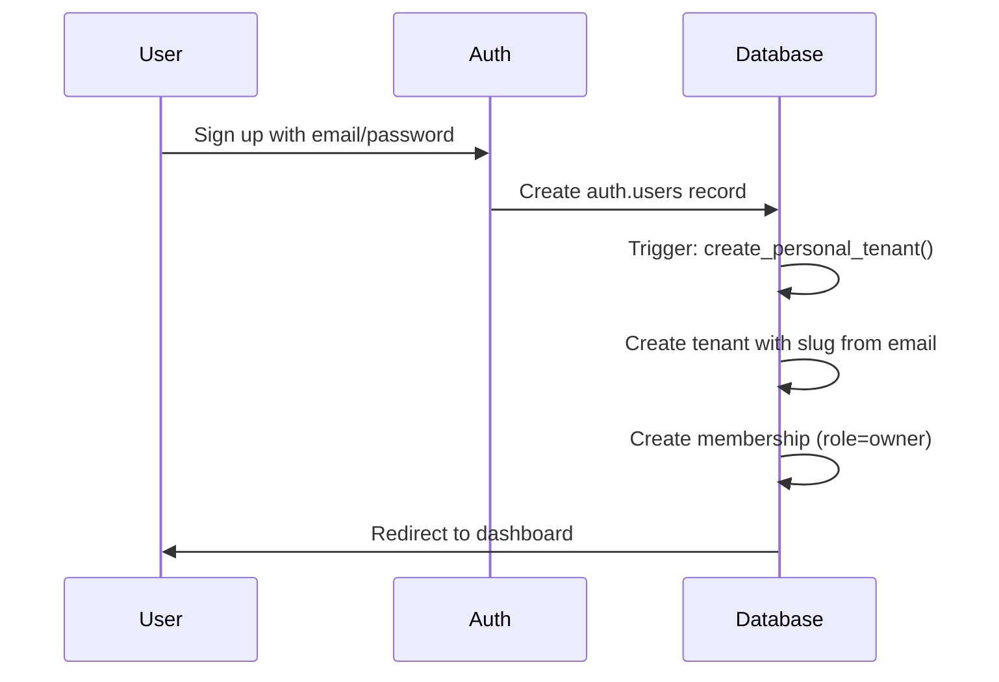
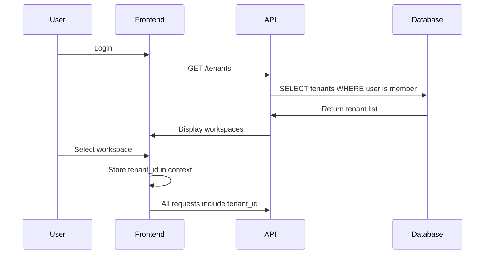
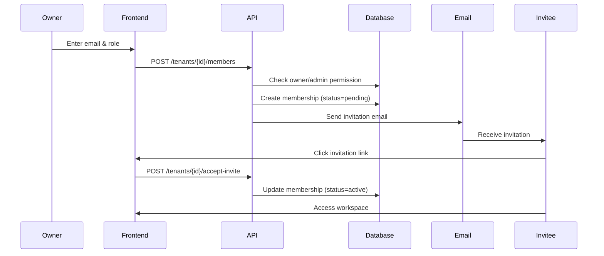
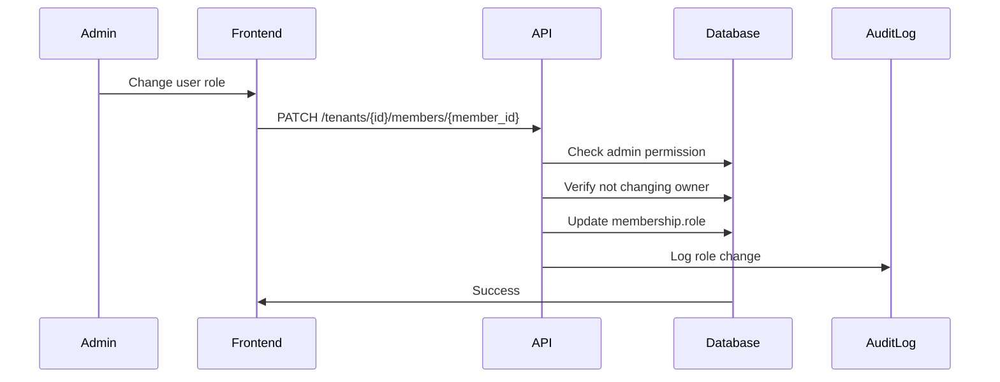

# LifeOS Multi-Tenant Architecture

## Overview

LifeOS implements a comprehensive multi-tenant architecture that enables:
- **Personal workspaces** for individual users
- **Family workspaces** for household members
- **Team workspaces** for small organizations
- **Enterprise workspaces** for larger organizations

Each tenant (workspace) provides complete data isolation while sharing the same application infrastructure.

---

## Core Concepts

### 1. Tenant (Workspace)

A **tenant** is an isolated environment where users collaborate and manage their LifeOS data.

**Key Properties:**
- `id`: Unique identifier (UUID)
- `name`: Display name (e.g., "Magaya Family", "OffSyd Creative")
- `slug`: URL-friendly identifier (e.g., `magaya-family`, `offsyd-creative`)
- `plan`: Subscription level (`free`, `starter`, `pro`, `enterprise`)
- `created_at`, `updated_at`: Timestamps

**Slug Rules:**
- 3-50 characters
- Lowercase letters, numbers, hyphens only
- Must be globally unique
- Automatically generated from user email on signup

### 2. Membership

A **membership** represents a user's relationship with a tenant.

**Key Properties:**
- `user_id`: User in the membership
- `tenant_id`: Tenant being accessed
- `role`: User's role in this tenant
- `status`: Membership state (`pending`, `active`, `revoked`)
- `invited_email`: Email used for invitation (if pending)
- `invited_by`: User who sent the invitation

**Constraints:**
- Each user can only have ONE membership per tenant
- A user can belong to MULTIPLE tenants with different roles

### 3. Roles

LifeOS implements hierarchical role-based access control (RBAC):

| Role | Description | Permissions |
|------|-------------|-------------|
| **Owner** | Workspace creator, full control | - Manage billing & subscription<br>- Delete workspace<br>- Manage all members<br>- Full CRUD on all data |
| **Admin** | Trusted administrator | - Manage members (except owner)<br>- Configure automation rules<br>- Full CRUD on all data<br>- View all reports |
| **Member** | Regular user | - CRUD on own data<br>- View shared dashboards<br>- Collaborate on projects<br>- Limited automation config |
| **Viewer** | Read-only observer | - View dashboards<br>- View reports<br>- Export own data<br>- No create/update/delete |

---

## Data Isolation Model

### Tenant Scoping

**ALL user data is scoped to a tenant:**

| Table | Tenant Field | User Field | Isolation Rule |
|-------|--------------|------------|----------------|
| `metrics` | `tenant_id` | `user_id` | User + Tenant |
| `ultra_metrics` | `tenant_id` | `user_id` | User + Tenant |
| `logs` | `tenant_id` | `user_id` | User + Tenant |
| `projects` | `tenant_id` | `user_id` | User + Tenant |
| `tasks` | via `projects` | via `projects` | Inherited |
| `habits` | `tenant_id` | `user_id` | User + Tenant |
| `habit_checkins` | via `habits` | via `habits` | Inherited |
| `calendar_entries` | `tenant_id` | `user_id` | User + Tenant |
| `auto_actions` | `tenant_id` | `user_id` | User + Tenant |
| `automation_executions` | `tenant_id` | `user_id` | User + Tenant |
| `system_state_daily` | `tenant_id` | `user_id` | User + Tenant |
| `state_warnings` | `tenant_id` | `user_id` | User + Tenant |

### RLS Policy Pattern

Every data table uses this RLS pattern:

```sql
-- SELECT: User can view data in their tenants
CREATE POLICY "Users can view {table} in their tenants"
  ON public.{table}
  FOR SELECT
  TO authenticated
  USING (
    user_id = auth.uid() AND
    (tenant_id IS NULL OR public.is_tenant_member(auth.uid(), tenant_id))
  );

-- INSERT: User can create data in their tenants
CREATE POLICY "Users can insert {table} in their tenants"
  ON public.{table}
  FOR INSERT
  TO authenticated
  WITH CHECK (
    user_id = auth.uid() AND
    (tenant_id IS NULL OR public.is_tenant_member(auth.uid(), tenant_id))
  );

-- UPDATE: User can update data in their tenants
CREATE POLICY "Users can update {table} in their tenants"
  ON public.{table}
  FOR UPDATE
  TO authenticated
  USING (
    user_id = auth.uid() AND
    (tenant_id IS NULL OR public.is_tenant_member(auth.uid(), tenant_id))
  );

-- DELETE: User can delete data in their tenants
CREATE POLICY "Users can delete {table} in their tenants"
  ON public.{table}
  FOR DELETE
  TO authenticated
  USING (
    user_id = auth.uid() AND
    (tenant_id IS NULL OR public.is_tenant_member(auth.uid(), tenant_id))
  );
```

**Key Security Features:**
- ✅ User must be authenticated (`TO authenticated`)
- ✅ User must own the data (`user_id = auth.uid()`)
- ✅ User must be member of tenant (`is_tenant_member()`)
- ✅ Backwards compatible with existing data (`tenant_id IS NULL`)

---

## Security Functions

### 1. `is_tenant_member(user_id, tenant_id)`

Check if user has ANY active membership in tenant.

```sql
SELECT public.is_tenant_member(auth.uid(), 'tenant-uuid-here');
-- Returns: true/false
```

**Use Cases:**
- RLS policies (data access)
- API authorization checks
- UI visibility logic

### 2. `has_tenant_role(user_id, tenant_id, role)`

Check if user has SPECIFIC role in tenant.

```sql
SELECT public.has_tenant_role(auth.uid(), 'tenant-uuid-here', 'owner');
-- Returns: true/false
```

**Use Cases:**
- Role-specific permissions
- Admin-only operations
- Billing management

### 3. `is_tenant_admin(user_id, tenant_id)`

Check if user is owner OR admin of tenant.

```sql
SELECT public.is_tenant_admin(auth.uid(), 'tenant-uuid-here');
-- Returns: true/false
```

**Use Cases:**
- Member management
- Settings configuration
- Workspace deletion

### 4. `get_user_tenant_role(user_id, tenant_id)`

Get user's role in specific tenant.

```sql
SELECT public.get_user_tenant_role(auth.uid(), 'tenant-uuid-here');
-- Returns: 'owner' | 'admin' | 'member' | 'viewer' | NULL
```

**Use Cases:**
- UI role badges
- Conditional rendering
- Audit logging

---

## User Flows

### 1. New User Signup Flow



**What Happens:**
1. User signs up via `/auth` page
2. Supabase Auth creates user in `auth.users`
3. Database trigger `on_auth_user_created_create_tenant` fires
4. Personal tenant created with name from user metadata
5. Unique slug generated from email (e.g., `john-smith-123`)
6. Owner membership created linking user to tenant
7. User automatically logged into their personal workspace

### 2. Workspace Selector Flow



**Implementation Notes:**
- After login, user sees workspace selector if multiple tenants
- Selected tenant stored in React context/state
- All API calls include `tenant_id` in header or path
- UI reflects current workspace name

### 3. Invite Member Flow



**Security Checks:**
- Only owner/admin can invite
- Invited email stored for validation
- Invitation includes secure token
- Token expires after 7 days
- User must verify email before accepting

### 4. Role Change Flow



**Business Rules:**
- Owner role cannot be changed (must transfer ownership)
- Only owner can assign admin role
- Admin cannot modify owner's role
- Role changes logged to audit table

---

## API Design

### Tenant Endpoints

#### `GET /tenants`
List all tenants where user is member.

**Response:**
```json
{
  "tenants": [
    {
      "id": "uuid",
      "name": "Magaya Family",
      "slug": "magaya-family",
      "plan": "pro",
      "role": "owner",
      "member_count": 4,
      "created_at": "2024-01-01T00:00:00Z"
    }
  ]
}
```

#### `POST /tenants`
Create new tenant (workspace).

**Request:**
```json
{
  "name": "My New Workspace",
  "slug": "my-new-workspace"  // optional, auto-generated if omitted
}
```

**Response:**
```json
{
  "tenant": {
    "id": "uuid",
    "name": "My New Workspace",
    "slug": "my-new-workspace",
    "plan": "free",
    "role": "owner"
  }
}
```

#### `GET /tenants/{tenant_id}`
Get tenant details.

**Response:**
```json
{
  "id": "uuid",
  "name": "Magaya Family",
  "slug": "magaya-family",
  "plan": "pro",
  "created_at": "2024-01-01T00:00:00Z",
  "member_count": 4,
  "user_role": "owner"
}
```

#### `PATCH /tenants/{tenant_id}`
Update tenant details (owner/admin only).

**Request:**
```json
{
  "name": "Updated Workspace Name"
}
```

#### `DELETE /tenants/{tenant_id}`
Delete tenant (owner only).

**⚠️ Warning:** This permanently deletes all data in the workspace.

### Membership Endpoints

#### `GET /tenants/{tenant_id}/members`
List all members of tenant.

**Response:**
```json
{
  "members": [
    {
      "id": "uuid",
      "user_id": "uuid",
      "email": "user@example.com",
      "name": "John Doe",
      "role": "owner",
      "status": "active",
      "joined_at": "2024-01-01T00:00:00Z"
    }
  ]
}
```

#### `POST /tenants/{tenant_id}/members`
Invite new member (owner/admin only).

**Request:**
```json
{
  "email": "newuser@example.com",
  "role": "member"
}
```

#### `PATCH /tenants/{tenant_id}/members/{member_id}`
Update member role (owner/admin only).

**Request:**
```json
{
  "role": "admin"
}
```

#### `DELETE /tenants/{tenant_id}/members/{member_id}`
Remove member (owner/admin only).

### Tenant-Scoped Data Endpoints

All existing endpoints support tenant scoping:

```
GET    /tenants/{tenant_id}/logs
POST   /tenants/{tenant_id}/logs
GET    /tenants/{tenant_id}/logs/{log_id}
PATCH  /tenants/{tenant_id}/logs/{log_id}
DELETE /tenants/{tenant_id}/logs/{log_id}

GET    /tenants/{tenant_id}/metrics
POST   /tenants/{tenant_id}/metrics
...

GET    /tenants/{tenant_id}/projects
POST   /tenants/{tenant_id}/projects
...

GET    /tenants/{tenant_id}/habits
POST   /tenants/{tenant_id}/habits
...

GET    /tenants/{tenant_id}/calendar
POST   /tenants/{tenant_id}/calendar
...
```

**Authorization Pattern:**
Every endpoint:
1. Extracts `tenant_id` from path
2. Verifies user is member: `is_tenant_member(user_id, tenant_id)`
3. Applies RLS policies automatically
4. Returns 403 if user not member

---

## Migration Strategy

### Existing Users

Users with existing data (pre-multi-tenant):
- Personal tenant auto-created on first login post-migration
- All existing data backfilled with `tenant_id = personal_tenant_id`
- User remains owner of personal tenant
- No data loss, seamless transition

### Data Backfill Script

```sql
-- Run after migration to backfill existing data
DO $$
DECLARE
  user_record RECORD;
  tenant_id_var UUID;
BEGIN
  FOR user_record IN SELECT id FROM auth.users LOOP
    -- Get or create personal tenant
    SELECT id INTO tenant_id_var
    FROM tenants t
    JOIN memberships m ON m.tenant_id = t.id
    WHERE m.user_id = user_record.id AND m.role = 'owner'
    LIMIT 1;
    
    -- Update all user data with tenant_id
    IF tenant_id_var IS NOT NULL THEN
      UPDATE metrics SET tenant_id = tenant_id_var WHERE user_id = user_record.id AND tenant_id IS NULL;
      UPDATE ultra_metrics SET tenant_id = tenant_id_var WHERE user_id = user_record.id AND tenant_id IS NULL;
      UPDATE logs SET tenant_id = tenant_id_var WHERE user_id = user_record.id AND tenant_id IS NULL;
      UPDATE projects SET tenant_id = tenant_id_var WHERE user_id = user_record.id AND tenant_id IS NULL;
      UPDATE habits SET tenant_id = tenant_id_var WHERE user_id = user_record.id AND tenant_id IS NULL;
      UPDATE calendar_entries SET tenant_id = tenant_id_var WHERE user_id = user_record.id AND tenant_id IS NULL;
      UPDATE auto_actions SET tenant_id = tenant_id_var WHERE user_id = user_record.id AND tenant_id IS NULL;
      UPDATE automation_executions SET tenant_id = tenant_id_var WHERE user_id = user_record.id AND tenant_id IS NULL;
      UPDATE system_state_daily SET tenant_id = tenant_id_var WHERE user_id = user_record.id AND tenant_id IS NULL;
      UPDATE state_warnings SET tenant_id = tenant_id_var WHERE user_id = user_record.id AND tenant_id IS NULL;
    END IF;
  END LOOP;
END $$;
```

---

## Frontend Implementation

### React Context Pattern

```typescript
// contexts/TenantContext.tsx
import { createContext, useContext, useState, useEffect } from 'react';

interface Tenant {
  id: string;
  name: string;
  slug: string;
  plan: string;
  role: string;
}

interface TenantContextType {
  currentTenant: Tenant | null;
  tenants: Tenant[];
  setCurrentTenant: (tenant: Tenant) => void;
  loading: boolean;
}

const TenantContext = createContext<TenantContextType | undefined>(undefined);

export function TenantProvider({ children }: { children: React.ReactNode }) {
  const [currentTenant, setCurrentTenant] = useState<Tenant | null>(null);
  const [tenants, setTenants] = useState<Tenant[]>([]);
  const [loading, setLoading] = useState(true);
  
  useEffect(() => {
    loadTenants();
  }, []);
  
  async function loadTenants() {
    // Fetch tenants from API
    const response = await fetch('/api/tenants');
    const data = await response.json();
    setTenants(data.tenants);
    
    // Set first tenant as current or load from localStorage
    const savedTenantId = localStorage.getItem('currentTenantId');
    const defaultTenant = savedTenantId
      ? data.tenants.find(t => t.id === savedTenantId)
      : data.tenants[0];
    
    setCurrentTenant(defaultTenant || null);
    setLoading(false);
  }
  
  function handleSetCurrentTenant(tenant: Tenant) {
    setCurrentTenant(tenant);
    localStorage.setItem('currentTenantId', tenant.id);
  }
  
  return (
    <TenantContext.Provider value={{
      currentTenant,
      tenants,
      setCurrentTenant: handleSetCurrentTenant,
      loading
    }}>
      {children}
    </TenantContext.Provider>
  );
}

export function useTenant() {
  const context = useContext(TenantContext);
  if (!context) throw new Error('useTenant must be used within TenantProvider');
  return context;
}
```

### Workspace Selector Component

```typescript
// components/WorkspaceSelector.tsx
import { useTenant } from '@/contexts/TenantContext';
import { Button } from '@/components/ui/button';
import {
  DropdownMenu,
  DropdownMenuContent,
  DropdownMenuItem,
  DropdownMenuTrigger,
} from '@/components/ui/dropdown-menu';

export function WorkspaceSelector() {
  const { currentTenant, tenants, setCurrentTenant } = useTenant();
  
  if (!currentTenant) return null;
  
  return (
    <DropdownMenu>
      <DropdownMenuTrigger asChild>
        <Button variant="outline">
          {currentTenant.name}
        </Button>
      </DropdownMenuTrigger>
      <DropdownMenuContent>
        {tenants.map(tenant => (
          <DropdownMenuItem
            key={tenant.id}
            onClick={() => setCurrentTenant(tenant)}
          >
            {tenant.name}
            {tenant.role === 'owner' && ' (Owner)'}
          </DropdownMenuItem>
        ))}
        <DropdownMenuItem onClick={() => {/* Create new workspace */}}>
          + Create Workspace
        </DropdownMenuItem>
      </DropdownMenuContent>
    </DropdownMenu>
  );
}
```

### API Hook Pattern

```typescript
// hooks/useApi.ts
import { useTenant } from '@/contexts/TenantContext';

export function useApi() {
  const { currentTenant } = useTenant();
  
  async function apiCall(endpoint: string, options?: RequestInit) {
    if (!currentTenant) throw new Error('No tenant selected');
    
    // Inject tenant_id into path
    const url = endpoint.startsWith('/tenants/')
      ? endpoint
      : `/tenants/${currentTenant.id}${endpoint}`;
    
    const response = await fetch(url, {
      ...options,
      headers: {
        ...options?.headers,
        'Content-Type': 'application/json',
      },
    });
    
    if (!response.ok) throw new Error(`API error: ${response.status}`);
    return response.json();
  }
  
  return { apiCall };
}
```

---

## Testing Strategy

### Unit Tests

```typescript
// tests/tenant-isolation.test.ts
describe('Tenant Isolation', () => {
  it('should not allow user to access another tenant data', async () => {
    // Create two users in different tenants
    const user1 = await createUser('user1@example.com');
    const user2 = await createUser('user2@example.com');
    
    // User 1 creates a log
    const log = await createLog(user1, { metric: 'test' });
    
    // User 2 attempts to access User 1's log
    const response = await fetchLog(user2, log.id);
    
    expect(response.status).toBe(403);
  });
  
  it('should allow members of same tenant to access shared data', async () => {
    // Create tenant with two members
    const owner = await createUser('owner@example.com');
    const member = await inviteMember(owner.tenant_id, 'member@example.com');
    
    // Owner creates a project
    const project = await createProject(owner, { title: 'Team Project' });
    
    // Member can access the project
    const response = await fetchProject(member, project.id);
    
    expect(response.status).toBe(200);
    expect(response.data.id).toBe(project.id);
  });
});
```

### Integration Tests

```typescript
// tests/workspace-flow.test.ts
describe('Workspace Management Flow', () => {
  it('should complete full workspace lifecycle', async () => {
    // Create workspace
    const workspace = await createWorkspace('Test Workspace');
    expect(workspace.slug).toMatch(/^[a-z0-9-]+$/);
    
    // Invite member
    const invitation = await inviteMember(workspace.id, 'member@example.com', 'member');
    expect(invitation.status).toBe('pending');
    
    // Accept invitation
    const membership = await acceptInvitation(invitation.token);
    expect(membership.status).toBe('active');
    
    // Change role
    await updateMemberRole(workspace.id, membership.id, 'admin');
    
    // Remove member
    await removeMember(workspace.id, membership.id);
    
    // Delete workspace
    await deleteWorkspace(workspace.id);
  });
});
```

---

## Performance Considerations

### Indexing Strategy

All tenant_id columns are indexed for optimal query performance:

```sql
CREATE INDEX idx_{table}_tenant_id ON public.{table}(tenant_id);
```

### Query Patterns

**✅ Efficient:**
```sql
SELECT * FROM metrics 
WHERE tenant_id = $1 AND user_id = $2;
-- Uses composite index scan
```

**❌ Inefficient:**
```sql
SELECT * FROM metrics 
WHERE user_id = $2;
-- Full table scan across all tenants
```

### Caching Strategy

- Cache tenant membership lookups (5-minute TTL)
- Cache user role within tenant (5-minute TTL)
- Cache workspace list per user (1-minute TTL)
- Invalidate caches on role changes

---

## Monitoring & Observability

### Key Metrics

- Tenant count by plan
- Active users per tenant
- Data volume per tenant
- API requests per tenant
- Failed authorization attempts

### Alerts

- Tenant exceeds data quota
- Unusual membership changes
- Failed tenant access attempts
- Orphaned data (no tenant_id)

---

## Future Enhancements

### Phase 2: Advanced Features

- [ ] Tenant-level feature flags
- [ ] Custom domains per tenant
- [ ] SSO integration (SAML, OAuth)
- [ ] Audit log per tenant
- [ ] Data export per tenant
- [ ] Tenant cloning/templates

### Phase 3: Enterprise Features

- [ ] Multi-region tenants
- [ ] Data residency controls
- [ ] Tenant-specific encryption keys
- [ ] Advanced RBAC (custom roles)
- [ ] Tenant hierarchy (sub-workspaces)
- [ ] Cross-tenant data sharing

---

## Conclusion

The LifeOS multi-tenant architecture provides:
- ✅ Complete data isolation
- ✅ Flexible collaboration models
- ✅ Enterprise-grade security
- ✅ Scalable design
- ✅ Backwards compatibility
- ✅ Clear upgrade path

All existing single-user functionality is preserved while enabling powerful team collaboration features.